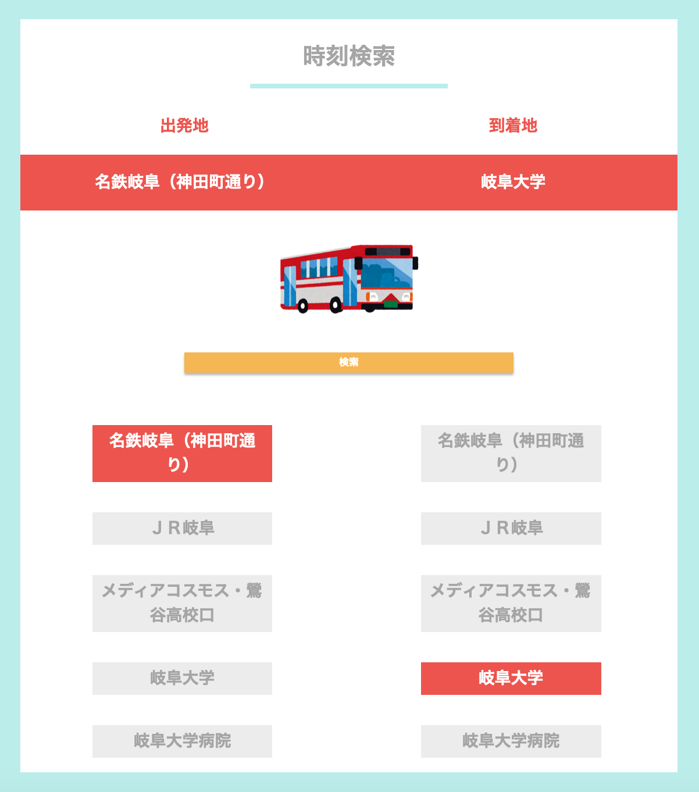
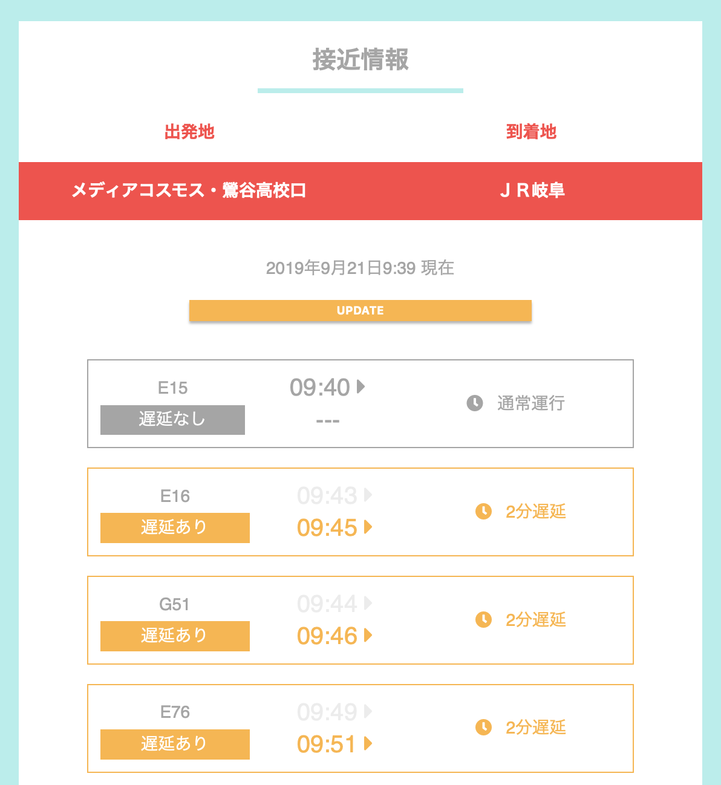

# GifuBusUI

**デプロイ済み**：https://gifubus-ui.herokuapp.com/

**開発に使用したもの**：Python, Django, HTML, CSS, Javascript, Heroku

## どんなアプリか

- 岐阜バスを快適に利用するために、時刻表を改善することを目的としたwebアプリ

## なぜ作ったか

- 面倒なバス停情報のテキスト入力をGUIボタンに置き換える
  - 通勤・通学に利用するバス停はいつも同じ
  - 毎日同じバス停名をテキスト入力するのは無駄が多い
  - バス停をGUIで選択できる
  - テキスト入力する必要がないので、必要な画面タップの回数が数回だけ
- 遅延情報で並び替えた時刻表を表示する
  - バスの遅延は頻繁に起こる
  - １つのバス停には到着地は同じでも複数の線のバスが通る
  - １つのバス停に行き先の違う複数のバスが通る
  - どのバスに乗ればいいかを悩むことなくバスを利用できる

